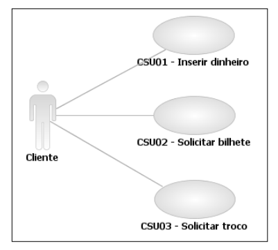
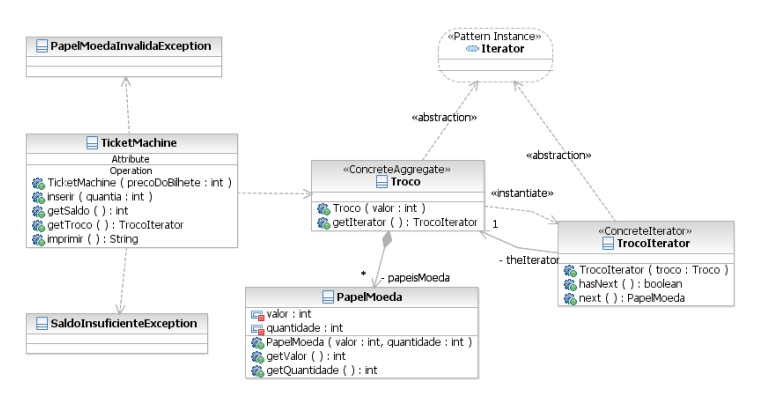
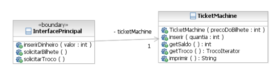
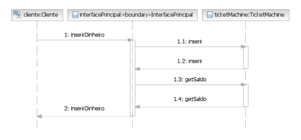
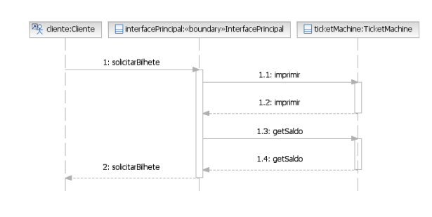
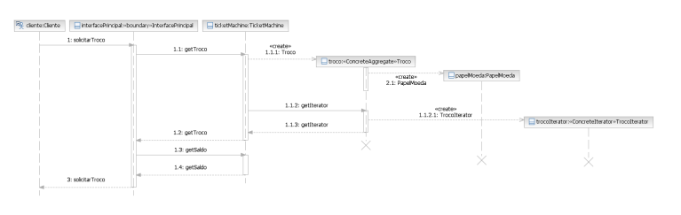

# 1. Requisitos

As estações de trem frequentemente fornecem máquinas de vender bilhetes que imprimem um bilhete quando um cliente insere a quantia correta para pagar a passagem, se houver troco a máquina informa e devolve o troco. As máquinas mantêm uma soma total da quantidade de dinheiro que coletou durante toda sua operação.

## 1.1 Catálogo dos Atores

| Ator    | Descrição                                |
|---------|------------------------------------------|
| Cliente | Usuário da máquina de vender bilhetes.   |

## 1.2 Diagrama dos Casos de Uso

## 1.3 Especificação dos Casos de Uso

### 1.3.1 CSU01 – Inserir dinheiro
| Identificador | CSU01             |
|---------------|-------------------|
| Nome          | Inserir dinheiro  |
| Atores        | Cliente           |
| Sumário           | Uma quantia de dinheiro é inserida na máquina. É importante ressaltar que essa quantia sempre é representada por uma única nota de papel-moeda.   |
| Complexidade      | Médio                                                                                                                                             |
| Regras de Negócio  | N/D                                                                                                                                              |
| Pré-condições     | N/D                                                                                                                                               |
| Pós-condição      | O valor inserido é adicionado ao saldo total disponível.                                                                                          |
| Pontos de Inclusão | N/D                                                                                                                                              |
| Pontos de Extensão | N/D                                                                                                                                              |

||
|--------------------|
| Fluxo Principal |

| **Ações do Ator**                                    | **Ações do Sistema**                                                                 |
|------------------------------------------------------|--------------------------------------------------------------------------------------|
| 1. O Cliente insere uma nota de papel-moeda.         |    |
|                                                      |2. O Sistema mostra uma mensagem informando para o Cliente aguardar alguns instantes.|
|                                                      | 3. O Sistema valida a nota de papel-moeda inserida.                                   |
|                                                      | 4. O Sistema adiciona o valor ao saldo disponível.                                   |
|                                                      | 5. O Sistema informa que a nota de papel-moeda foi aceita.                           |
|                                                      | 6. O Sistema informa o saldo atual. Caso de Uso é encerrado.                         |

||
|--------------------|
| Fluxo De Exceção |

| **Ações do Ator**                                    | **Ações do Sistema**                                                                 |
|------------------------------------------------------|--------------------------------------------------------------------------------------|
| 1. O Sistema não valida a nota de papel-moeda.       |                                                                                      |
|                                                      | 2. O Sistema devolve a nota de papel-moeda.                                          |
|                                                      | 3. Enquanto o Cliente não retirar a nota de papel-moeda, o Sistema informa que a nota é inválida. |
| 3. O Cliente retira a nota de papel-moeda.           |                                                                                      |
|                                                      | 4. Volta ao passo 6 do Fluxo Principal.                                              |

### 1.3.2 CSU02 – Solicitar bilhete

| Identificador | CSU02             |
|---------------|-------------------|
| Nome          | Solicitar bilhete  |
| Atores        | Cliente           |
| Sumário           | Um único bilhete de transporte é impresso.   |
| Complexidade      | Fácil                                                                                                                                             |
| Regras de Negócio  | N/D                                                                                                                                              |
| Pré-condições     | N/D                                                                                                                                               |
| Pós-condição      | Um bilhete é impresso e seu valor é debitado do saldo disponível.                                                                                 |
| Pontos de Inclusão | N/D                                                                                                                                              |
| Pontos de Extensão | N/D                                                                                                                                              |

||
|--------------------|
| Fluxo Principal |

| **Ações do Ator**                                    | **Ações do Sistema**                                                                 |
|------------------------------------------------------|--------------------------------------------------------------------------------------|
| 1. O Cliente insere uma nota de papel-moeda.         |                                                                                      |
|                                                      | 2. O Sistema verifica o saldo e emite o bilhete.                                     |
|                                                      | 3. O sistema informa o saldo atual. Caso de Uso é encerrado.                         |

||
|--------------------|
| Fluxo De Exceção |

| **Ações do Ator**                                    | **Ações do Sistema**                                                                 |
|------------------------------------------------------|--------------------------------------------------------------------------------------|
|                                                      | 1. O Sistema informa que o saldo é insuficiente. |
|                                                      | 2. Volta ao passo 3 do Fluxo Principal                                              |

### 1.3.3 CSU03 – Solicitar troco

| Identificador | CSU03             |
|---------------|-------------------|
| Nome          | Solicitar Troco  |
| Atores        | Cliente           |
| Sumário           | O troco é devolvido. Vale ressaltar que o troco também é em nota
de papel-moeda.   |
| Complexidade      | Fácil                                                                                                                                             |
| Regras de Negócio  | N/D                                                                                                                                              |
| Pré-condições     | N/D                                                                                                                                               |
| Pós-condição      | O valor em nota de papel-moeda é devolvido e o saldo disponível é zerado.                                                                         |
| Pontos de Inclusão | N/D                                                                                                                                              |
| Pontos de Extensão | N/D       

||
|--------------------|
| Fluxo Principal |

| **Ações do Ator**                                    | **Ações do Sistema**                                                                 |
|------------------------------------------------------|--------------------------------------------------------------------------------------|
| 1. O Cliente solicita devolução do saldo restante como troco.        |                                                                                      |
|                                                      | 2. O Sistema verifica o saldo e devolve a quantidade do saldo em notas de papel moeda.                                     |
|                                                      | 3. O Sistema zera o valor do saldo.                        |
|                                                      | 4. O sistema informa o saldo atual. Caso de Uso é encerrado.                        |

# 2. Projeto Orientado a Objetos

## 2.1 Diagrama de Classes Principal

## 2.2 Diagrama de Classes de interação

## 2.3 Diagrama de Sequência – Inserir dinheiro

## 2.4 Diagrama de Sequência – Solicitar bilhete

## 2.5 Diagrama de Sequência – Solicitar troco

É importante salientar que estes diagramas representam apenas o fluxo principal dos casos de uso